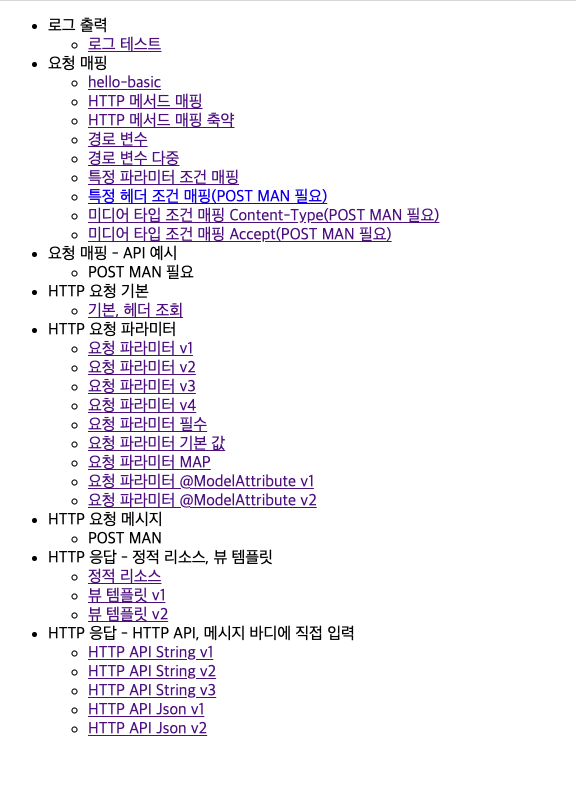
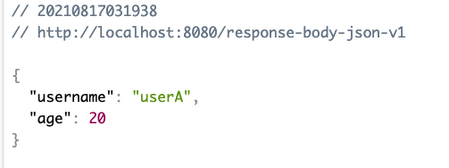

# Spring MVC 패턴
Spring MVC를 통해 HTTP 요청을 매핑, 조회, 파라미터 및 메시지 처리 및 응답하는 과정이며, Postsman을 사용하여 Test

## Description

로깅 라이브러리

- slf4j 라이브러리를 사용하여 로깅

요청 매핑

- HTTP 매서드, 특정 파라미터 조건 매핑
- 미디어 타입 조건 매핑(Json, Text)

요청 파라미터

- HTTP 요청 데이터 조회(쿼리 파라미터, HTML Form, HTTP Message Body)
- @RequestParam 사용법
- @ModelAttribute 사용법

HTTP 응답

- HTTP API, 메시지 바디에 입력해 JSON, Text 응답
- 정적 리소스 응답(html)
- Thymeleaf 활용하여 동적 리소스 응답 

## Images
    메인 화면

    HTTP JSON 응답

---
